<div align="center">


# TriviaTap

**Live multiplayer quiz, no login required**

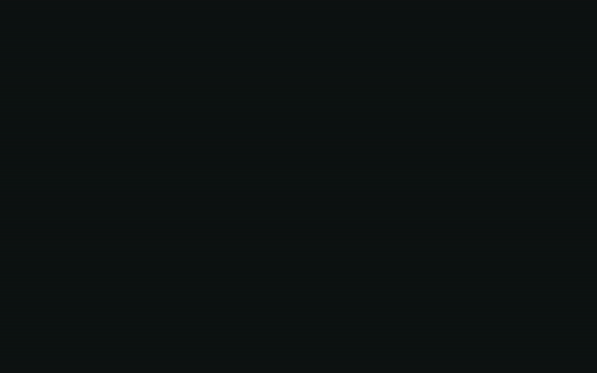

</div>

## What it is

TriviaTap is a live quiz game for a room full of people, built on the Frappe
Framework. The host puts a game PIN and QR code on the big screen. Players
join from their phones in a few seconds. Nobody signs up or installs anything.

Each question runs on a countdown. Faster correct answers score more points,
and a streak of correct answers adds a bonus. After each question the room
sees the answer split, an explanation and the leaderboard.

The server runs the game, so players can't cheat from their phones:

- The correct answer never reaches a phone until the question closes.
- The server sets the deadline, so a slow or tampered clock gains nothing.
- The server checks every answer against its own state of the game.

<details>
<summary>Screenshots</summary>

**Joining from a phone**

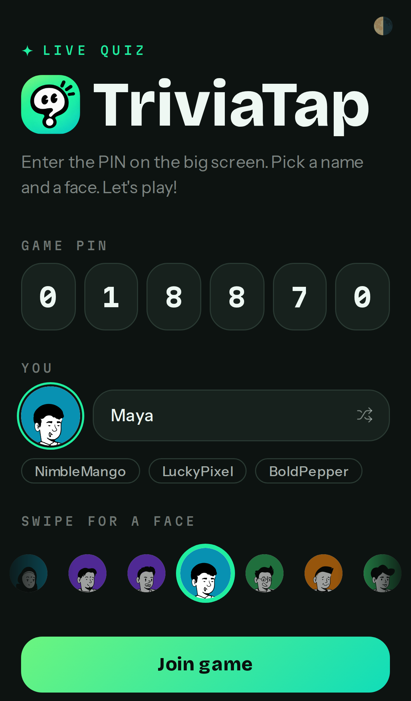

**Picking a quiz**

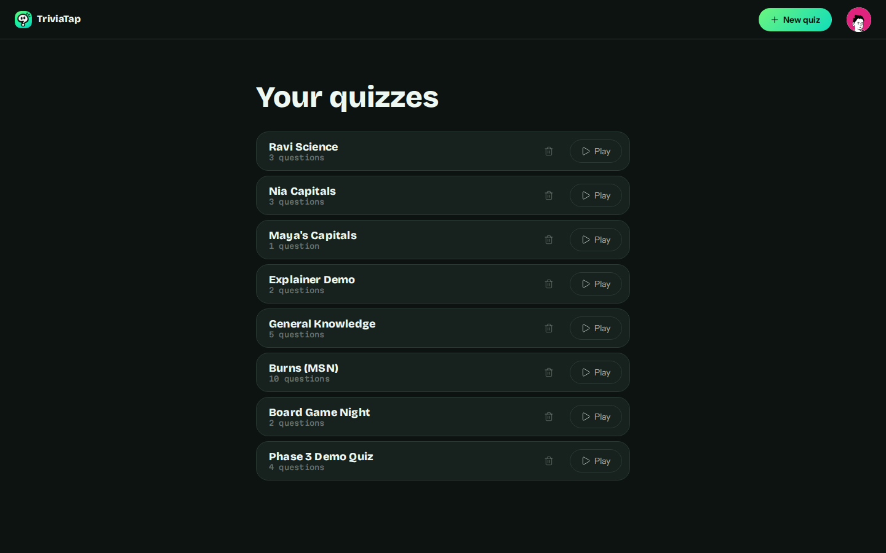

**A question, live on both screens**

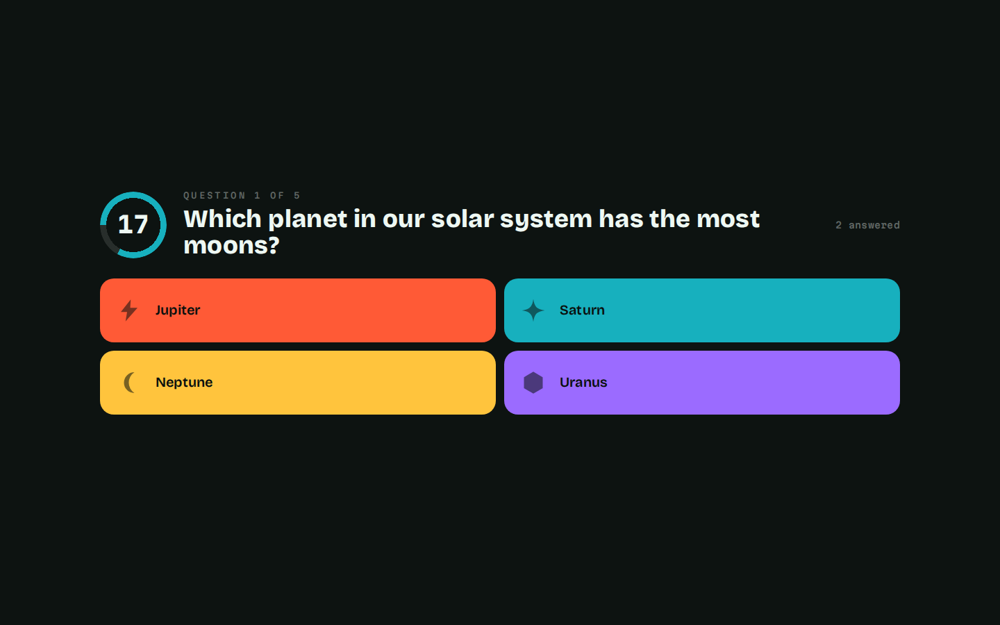

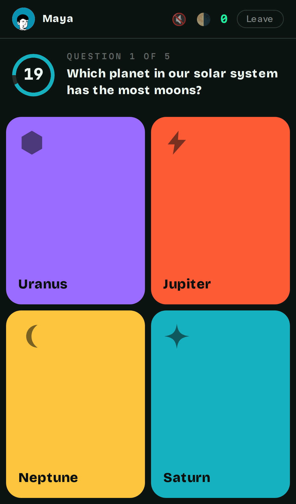

**Between questions**

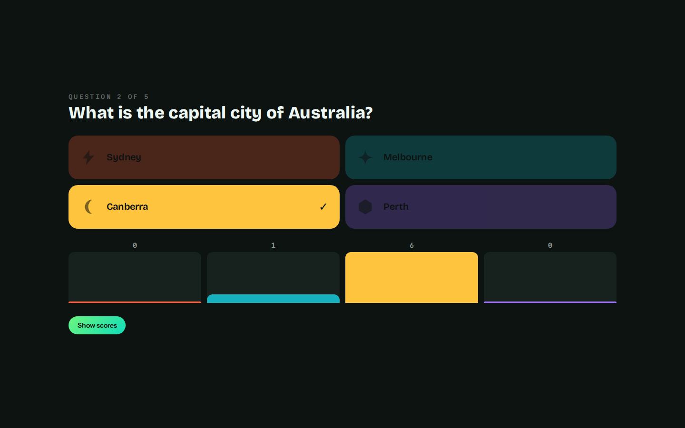

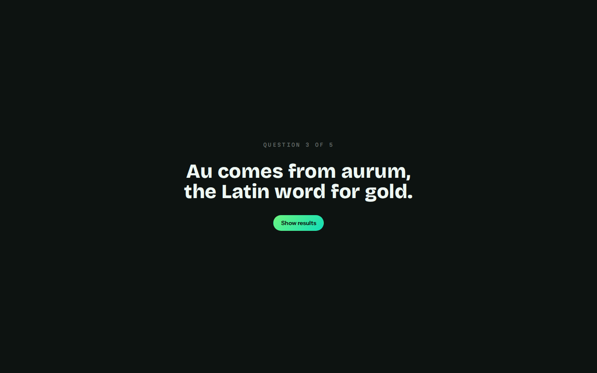

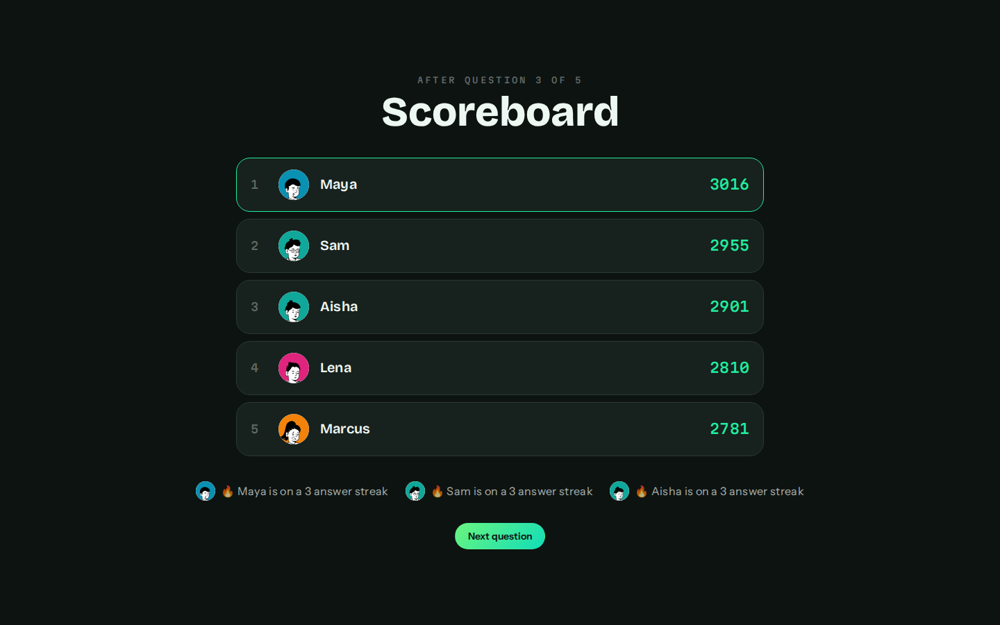

**Final results**

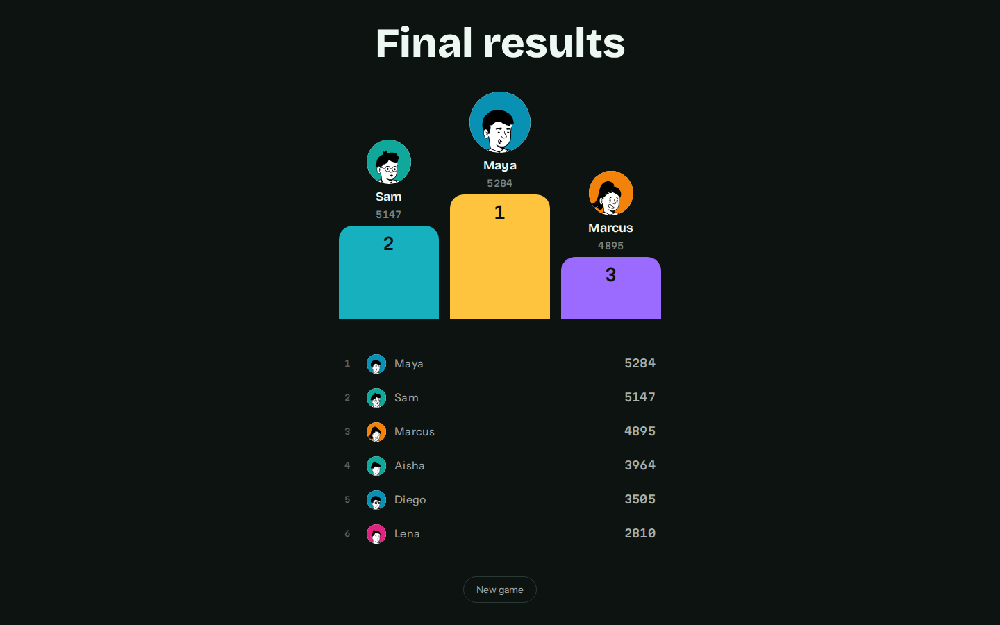

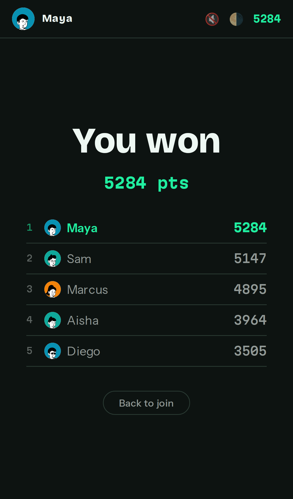

**Writing a quiz**

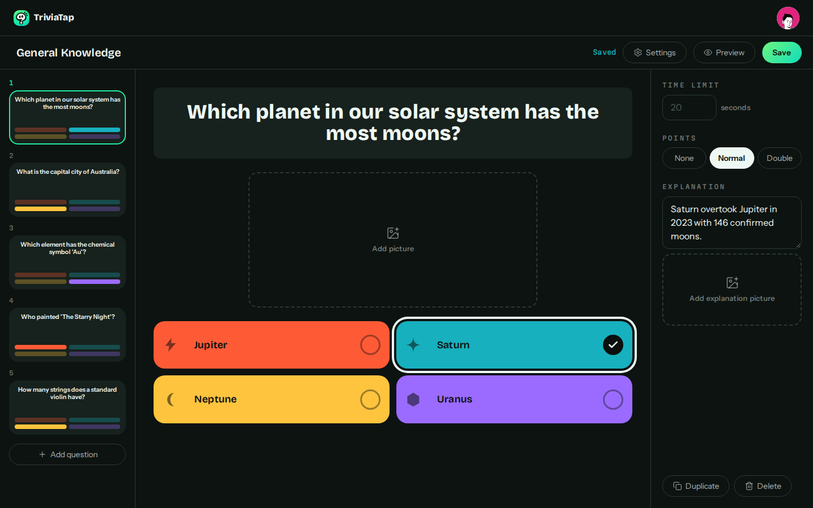

**Light and dark**

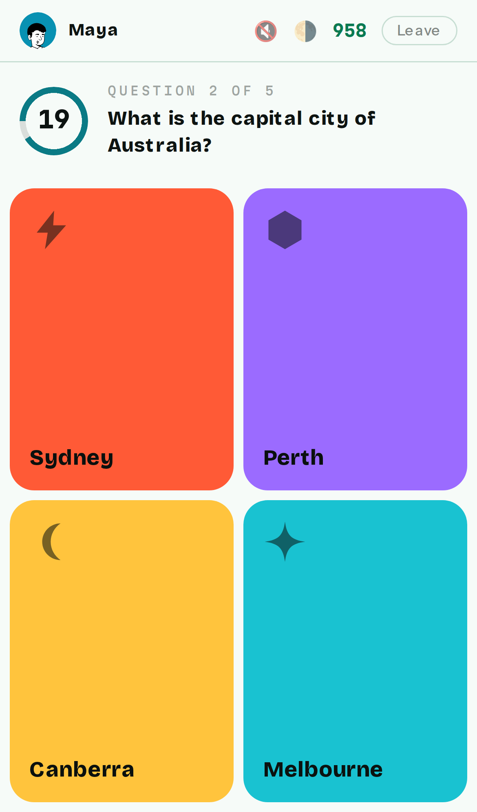

</details>

## Features

- Guests join with a PIN or QR code, no account and no app install
- Live lobby: names appear as players join, host can lock it or kick anyone
- Questions land on every device at once, with a per-question timer
- Speed-scaled scoring with streak bonuses, in the style of the games it borrows from
- Answer distribution, correct answer reveal and top-five leaderboard between questions
- Optional explanation per question, shown to the room before or after the results
- Top-three podium at the end, plus the full ranking
- Avatar picker and nickname suggestions for players
- Light and dark theme, everywhere
- Quizzes are written in the app, no Desk trip needed
- Hosts sign up with email or Google

## Under the hood

- [Frappe Framework](https://github.com/frappe/frappe) for the backend, DocTypes and permissions
- [Vue 3](https://vuejs.org) and [frappe-ui](https://github.com/frappe/frappe-ui) for the single-page app
- [Socket.IO](https://socket.io) to push every state change to hosts and players
- Redis for the hot session state each answer is validated against
- RQ for the single shared ticker that drives every live game loop

## Development setup

1. Set up a bench by following the
   [installation steps](https://frappeframework.com/docs/user/en/installation)
   and start the server with `bench start`.

2. In another terminal, from your bench directory:

```bash
bench get-app https://github.com/bwhtech/trivia_tap --branch develop
bench --site your-site.localhost install-app trivia_tap
```

The app is served at `/trivia-tap` on your site. For frontend work, run the Vite
dev server against it:

```bash
cd apps/trivia_tap/frontend
yarn install
yarn dev
```

### Google login (optional)

Hosts can sign up and log in with Google once the site has a Google key.

1. In [Google Cloud Console](https://console.cloud.google.com/apis/credentials),
   create an OAuth client ID of type Web application.
2. Add this authorized redirect URI:
   `<site url>/api/method/frappe.integrations.oauth2_logins.login_via_google`
3. In Desk, open Social Login Key, add a new one with provider Google, paste
   the client ID and secret, tick Enable Social Login and leave Sign ups blank so it follows the site sign up setting.

Google only accepts plain `http` for `localhost`, not `your-site.localhost`. To
try it locally, run `bench use your-site.localhost`, open
`http://localhost:8000/trivia-tap/login` and register
`http://localhost:8000/api/method/frappe.integrations.oauth2_logins.login_via_google`.

## Testing

```bash
bench --site your-site.localhost set-config allow_tests true
bench --site your-site.localhost run-tests --app trivia_tap
```

## Contributing

This app uses `pre-commit` for code formatting and linting. Please
[install pre-commit](https://pre-commit.com/#installation) and enable it for
this repository:

```bash
cd apps/trivia_tap
pre-commit install
```

Pre-commit is configured to use ruff, eslint, prettier and pyupgrade.

`plan.md` holds the build plan and architecture, `specs/` holds the spec for
each phase, and `progress.md` logs what was actually built.

## License

MIT
